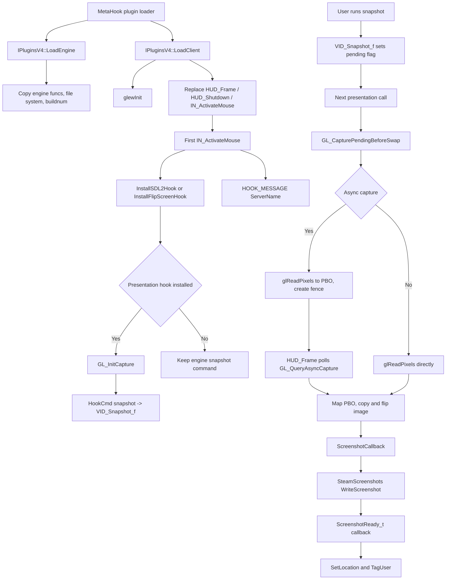

# SteamScreenshots

SteamScreenshots is a MetaHook plugin that takes over the engine's `snapshot` command, captures the
current OpenGL framebuffer and submits it to the Steam screenshot manager through Steamworks
`ISteamScreenshots`.

## Provenance

This repository is the standalone SteamScreenshots plugin, extracted from MetaHookSv
(`Plugins/SteamScreenshots/`) into its own CMake workspace, aligned with the standalone Renderer,
PrecacheManager and VGUI2Extension projects. This note was migrated from MetaHookSv
`memory/SteamScreenshots.md` and adapted to the new layout: plugin sources moved to `src/`, the
original MSBuild `.vcxproj` / `plugins_svencoop.lst` integration was replaced by CMake plus a
self-owned gamedata catalog, and capture was moved out of the engine snapshot path to the
presentation call (SDL2 swap / engine flip) so the frame is read before it leaves the back buffer.
The `metahooksv` Basic Memory project belongs to the source repository; notes here use the
`steamscreenshots` project and the `steamscreenshots/` permalink prefix.

## Responsibilities and entry points

- `src/plugins.cpp`: `IPluginsV4` lifecycle. `LoadEngine` collects the file system (`FileSystem` or
  `FileSystem_HL25`), engine type/buildnum and copies `cl_enginefunc_t`; `LoadClient` runs
  `glewInit()` and replaces `HUD_Frame`, `HUD_Shutdown` and `IN_ActivateMouse`; `ExitGame` discards a
  pending capture and uninstalls the presentation hook.
- `src/exportfuncs.cpp`: presentation-hook installation, Steam callback management and the
  `ServerName` user message. Also owns the replaced `HUD_Frame` / `IN_ActivateMouse` bodies.
- `src/gl_capture.cpp`: capture backend. Selects synchronous or PBO+fence asynchronous capture,
  reads pixels, flips the image and polls the async fence.
- `src/plugins.h`: engine/plugin globals, `private_funcs_t` (`SDL_GL_SwapWindow`, the engine
  `VID_FlipScreen` pointer slot and the function it held before the swap) and signature macros.
- `src/exportfuncs.h`, `src/gl_capture.h`: hook declarations and capture prototypes.

Key items:

- `InstallSDL2Hook` / `InstallFlipScreenHook` choose the presentation hook: Sven Co-op uses the IAT
  hook on `SDL2.dll!SDL_GL_SwapWindow` (`ModuleHasImportEx` + `IATHook`); GoldSrc uses the gamedata
  `engine`/`VID_FlipScreen` GLOBAL, which is the engine's own flip function-pointer slot
  (`GL_EndRendering` calls through it), so swapping the pointer redirects every flip without
  patching code.
- `IN_ActivateMouse` installs the presentation hook on its first call, initializes the capture
  backend and registers `snapshot` through `HookCmd`. Installation is deferred to this point because
  the engine registers `snapshot` after `HUD_Init`.
- `VID_Snapshot_f` only sets `g_CapturePending`. The real capture runs in
  `GL_CapturePendingBeforeSwap`, called just before forwarding to the original
  `SDL_GL_SwapWindow` / `VID_FlipScreen` — with Renderer enabled, Renderer's final blit has already
  run for that frame.
- `CSnapshotManager` registers the `ScreenshotReady_t` callback lazily, once both
  `SteamScreenshots()` and `SteamUser()` are available, and sets the screenshot Location to
  `g_szServerName` and tags the local Steam user.
- `__MsgFunc_ServerName` retains at most 255 bytes of the server name; `HUD_Frame` clears it at the
  main menu (empty `pfnGetLevelName`).
- `HUD_Shutdown` unregisters the Steam callback, shuts the capture backend down, then forwards to
  the original `HUD_Shutdown`.

## Architecture

## Dependencies

- **MetaHook API** (>= 109 for the gamedata global path, checked in `InstallFlipScreenHook`):
  `ResolveGameSymbol` / `GetGameSymbolStatusString` with `MH_GAMESYMBOL_KIND_GLOBAL`,
  `GetEngineBase`, `GetEngineModule`, `ModuleHasImportEx`, `IATHook`, `UnHook`, `HookCmd`,
  `GetVideoMode`, `GetEngineType`, `GetEngineBuildnum`, `SysError`.
- **HLSDK / client interfaces**: `cl_enginefunc_t` (`Con_Printf`, `pfnGetLevelName`),
  `cl_exportfuncs_t` (`HUD_Frame`, `HUD_Shutdown`, `IN_ActivateMouse`), `parsemsg`
  (`BEGIN_READ` / `READ_STRING`), `HOOK_MESSAGE(ServerName)`. `CreateInterface` and the
  `ServerName` message parser come from MetaHook's `include/HLSDK/common`.
- **SteamSDK (`SteamAPI`)**: `steam_api.h`, `ISteamScreenshots`, `ScreenshotReady_t`,
  `SteamUser`; linked as the imported target `SteamSDK::SteamAPI` and loaded from the game's
  `steam_api.dll` at runtime.
- **GLEW (static) + `opengl32`**: `glReadPixels`, `GL_PIXEL_PACK_BUFFER`, `glMapBuffer`,
  `glFenceSync` / `glClientWaitSync`. `GL_READ_FRAMEBUFFER` needs core/ARB framebuffer support
  (`GLEW_VERSION_3_0` or `GLEW_ARB_framebuffer_object`), not just `EXT_framebuffer_object`.
- **Build-only inputs**: Capstone headers (capture tests), GLFW (tests only), VC-LTL 5.3.1.
- **Runtime configuration**: `SteamScreenshots.dll` is listed in the host's
  `metahook/configs/plugins.lst`.

## Repository layout

- `src/plugins.cpp`, `src/plugins.h` — plugin lifecycle, host API and shared globals.
- `src/exportfuncs.cpp`, `src/exportfuncs.h` — hooks, Steam callbacks and the `ServerName` message.
- `src/gl_capture.cpp`, `src/gl_capture.h` — capture backend and prototypes.
- `CMakeLists.txt`, `cmake/Sources.cmake` (explicit compile list), `cmake/Dependencies.cmake`,
  `cmake/VCLTL.cmake` — build.
- `scripts/build-SteamScreenshots-x86-{Debug,Release}.bat` — configure/build/install entry points.
- `scripts/manifests/steamscreenshots.json`, `scripts/sync-gamedata.py`,
  `scripts/validate-gamedata.py` — gamedata synchronization and validation.
- `tests/` — the 11 OpenGL capture tests (CTest, `BUILD_TESTING=ON`).
- `docs/en/`, `docs/zh-CN/` — installation, build and test pages; `docs/DEPENDENCIES.md`.
- `README.md`, `README.zh-CN.md` — install, compatibility and build documentation.

## Build and data flow

`scripts/build-SteamScreenshots-x86-{Debug,Release}.bat` → CMake (Visual Studio 17 2022,
`-A Win32`) → compile the DLL → install. The build uses MSVC x86 / C++20, a static CRT and VC-LTL
5.3.1, with the explicit compile list in `cmake/Sources.cmake`; GLEW is configured from
`GLEW_SOURCE_PATH` as `libglew_static` and SteamSDK is consumed as an imported library.
`scripts/manifests/steamscreenshots.json` → `scripts/sync-gamedata.py` → pruned catalog under
`build/x86/<Configuration>/assets/svencoop/metahook/gamedata/steamscreenshots`, validated by
`scripts/validate-gamedata.py` before the plugin target builds; disable with
`-DSTEAMSCREENSHOTS_SYNC_GAMEDATA=OFF`. The catalog carries only `VID_FlipScreen`: `hl-10210` is the
validated global-hook build, `svencoop-10257` uses the SDL2 hook and needs no record, and the other
seven listed snapshots are upstream catalog coverage, not validated support.
Install output is `install/x86/<Configuration>/svencoop/metahook/{plugins,gamedata/steamscreenshots,licenses/SteamScreenshots}`;
nothing is deployed into the game automatically. Enabling `BUILD_TESTING` fetches pinned GLFW and
builds the capture tests; running them requires a desktop OpenGL 3.3 driver.

## Notes

- Hook installation is tied to the first `IN_ActivateMouse`; if that path never runs, neither the
  presentation hook nor the `snapshot` takeover is installed and the engine command is kept.
- Graceful degradation is deliberate: a missing `VID_FlipScreen` gamedata record, a failed
  `ResolveGameSymbol`, a MetaHook API older than 109, an engine without the `SDL2.dll` import, or a
  driver without core/ARB framebuffer support all log once and keep the engine's original `snapshot`
  command instead of failing at load time.
- Asynchronous capture requires OpenGL 3.2 with `glFenceSync` / `glClientWaitSync`; otherwise the
  synchronous path is used, which can stall for the duration of the read.
- Capture reads `GL_BACK` with tightly packed RGB rows, saves and restores the read-framebuffer
  binding, pixel-store state and PBO binding, then flips the image vertically because `glReadPixels`
  returns bottom-up rows. Both paths share the same flip loop.
- On the async path the fence is created when the capture is requested and polled once per frame in
  `HUD_Frame`; while a fence is pending, new requests are dropped. A video-mode change frees and
  reallocates the PBO and image buffer, and a failed fence wait discards the sync object.
- `g_szServerName` is capped at 255 bytes and cleared when not in a map; it is the Location value of
  the accepted screenshot.
- The Steam-facing paths now guard `SteamScreenshots()` / `SteamUser()` with one-shot console
  messages (the historical "no null-pointer protection" caveat no longer applies there); a missing
  interface still drops the capture rather than writing an invalid screenshot.
- `ScreenshotReady_t` results other than `k_EResultOK` and `k_EResultIOFailure` are reported as an
  unknown error; only `k_EResultOK` sets Location and tags the user.

## Callers (optional)

- The MetaHook plugin framework drives `Init` / `LoadEngine` / `LoadClient` / `ExitGame` through
  `EXPOSE_SINGLE_INTERFACE(..., METAHOOK_PLUGIN_API_VERSION_V4)` and loads the DLL from `plugins.lst`.
- The engine command system calls `VID_Snapshot_f` after `snapshot` is hooked; the engine's
  presentation path calls `SDL_GL_SwapWindow` or the swapped `VID_FlipScreen` pointer, which drives
  `GL_CapturePendingBeforeSwap`.
- Steam dispatches `ScreenshotReady_t` to `CSnapshotManager::OnSnapshotCallback`.
- Engine message dispatch reaches `__MsgFunc_ServerName` through `HOOK_MESSAGE(ServerName)`, and
  `HUD_Frame` / `HUD_Shutdown` drive fence polling and resource cleanup.

## External documentation

`README.md` is the English landing page and `README.zh-CN.md` the Chinese one; together with
`docs/en/` and `docs/zh-CN/` they cover installation, build, gamedata and tests.
